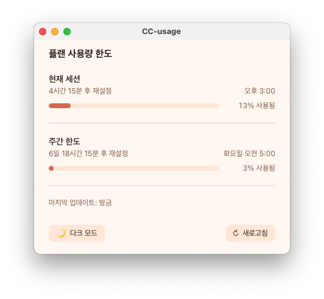

# CC-usage

**Claude Code 사용량을 실시간으로 모니터링하는 macOS 데스크톱 앱**

터미널 CLI, 웹(claude.ai) 어디서 사용하든 정확한 사용량을 표시합니다.



### 메뉴바 표시

macOS 메뉴바에 5시간 세션의 남은 시간과 사용률이 항상 표시됩니다.


## Installation

### 1. Claude Code 설치 및 로그인

```bash
npm install -g @anthropic-ai/claude-code
claude
```

### 2. Claude Code에서 설치

Claude Code에 다음과 같이 입력하세요:

```
https://github.com/HSUNEH/CC-usage 설치해줘
```

### 수동 설치

<details>
<summary>직접 빌드하기</summary>

```bash
# Rust 1.70+, Node.js 18+ 필요
git clone https://github.com/HSUNEH/CC-usage.git
cd CC-usage
npm install
npm run tauri build

open src-tauri/target/release/bundle/macos/CC-usage.app
```

</details>

브라우저에서 OAuth 인증 완료 후, 앱을 새로고침하면 사용량이 표시됩니다.

## Features

- **Haiku API 기반 조회** — Haiku에 최소 요청(9토큰)을 보내고 응답 헤더에서 정확한 rate limit 정보 추출
- **1분마다 자동 갱신** — CLI를 실행하지 않아도 사용량이 업데이트됨
- **파일 실시간 추적** — CLI 사용 중이면 30초마다 파일 변경 감지하여 더 빠른 업데이트
- **웹 사용분 반영** — claude.ai에서 사용한 양도 실시간 반영
- **메뉴바 표시** — 5시간 세션 남은 시간 + 사용률이 메뉴바에 항상 표시
- **5시간 세션 한도** — 사용률(%), 남은 시간, 리셋 시각
- **7일 주간 한도** — 사용률(%), 남은 일/시간, 리셋 요일+시각
- **0% 초기화 방어** — 새 CLI 세션 시작 시 파일이 0%로 리셋되어도 기존 데이터 유지
- **다크/라이트 모드** — 주황 테마 기반 전환

## How It Works

```
CC-usage App
  ├─ Haiku Messages API (1분마다)
  │    POST /v1/messages → "." (9토큰)
  │    ← 응답 헤더에서 utilization % 추출
  │
  └─ rate-limits.json (30초마다)
       CLI 실행 중이면 파일 변경 감지하여 더 빠른 업데이트
```

OAuth 토큰은 macOS Keychain에서 읽습니다 (Claude Code 로그인 시 자동 저장됨).

## Tech Stack

- **Frontend**: React 18 + TypeScript + Vite + Tailwind CSS
- **Backend**: Rust (Tauri 2) + reqwest
- **Auth**: OAuth token (macOS Keychain)
- **Data**: Anthropic Messages API 응답 헤더 (`anthropic-ratelimit-unified-*`)

## Acknowledgments

- Originally forked from [Claude Code Usage Dashboard](https://github.com/Zollicoff/Claude_Code_Usage_Dashboard)
- Built with [Tauri](https://tauri.app/)

## License

AGPL-3.0 — see [LICENSE](LICENSE) for details.
